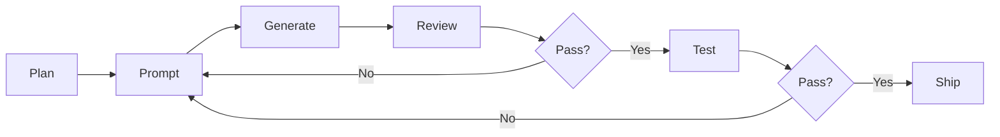

# Vibe Coding Methodology

A structured approach to AI-assisted programming based on the 2025Emma/vibe-coding-cn framework. The core principle: use natural language prompts to guide AI in generating code, while maintaining human control through planning, modularization, and review.

## Core Principles

### 1. Planning First
Before any code generation:
- Write a clear Product Requirements Document (PRD)
- Break features into atomic, testable modules
- Define acceptance criteria per feature
- Estimate complexity and set priorities

### 2. Modular Architecture
- **One feature per prompt** — don't ask AI to build everything at once
- **Interface contracts first** — define types/interfaces before implementation
- **Dependency layering** — build bottom-up (data → logic → UI)

### 3. Prompt Engineering for Code

#### Effective Code Prompts
```
BAD:  "Build me a trading dashboard"
GOOD: "Create a React component `PerformanceChart` that:
       - Accepts an array of EquityPoint objects with timestamp, and per-model balances
       - Uses Recharts LineChart with 5 colored lines (one per model)
       - Shows a tooltip with exact values on hover
       - Has a dark background (#0F1117) with grid lines at 20% opacity"
```

#### Structured Decision Prompts (for AI trading)
```
You are a crypto analyst. Given:
- Asset: {asset}
- Current Price: ${price}
- 5-min direction question: "{question}"

Respond ONLY in JSON:
{
  "decision": "BUY" | "SELL" | "WAIT",
  "confidence": 0.0-1.0,
  "reasoning": "one sentence"
}
```

### 4. Review Every Output
- **Never blindly accept AI code** — always review for edge cases
- **Test boundary conditions** — AI often misses null checks, race conditions
- **Check types** — AI may use `any` or wrong generics

## Development Workflow



### Step-by-Step
1. **Plan** — Define what to build (PRD, wireframe, or bullet points)
2. **Prompt** — Craft a specific, constrained prompt for the AI
3. **Generate** — Let AI produce code
4. **Review** — Check logic, types, edge cases, security
5. **Test** — Run automated tests + manual verification
6. **Ship** — Commit with clear message, deploy

## Tech Stack Recommendations
- **Frontend:** React + TypeScript + Tailwind CSS + shadcn/ui
- **Backend:** Node.js + Express or Next.js API routes
- **Database:** SQLite (dev) → PostgreSQL (prod)
- **AI Integration:** OpenRouter API (multi-model access)
- **Deployment:** Vercel / Railway / Docker

## Anti-Patterns to Avoid
1. ❌ Asking AI to "build the whole app" in one prompt
2. ❌ Not reviewing generated code before committing
3. ❌ Ignoring TypeScript errors ("it works anyway")
4. ❌ No tests for AI-generated business logic
5. ❌ Hardcoding secrets or API keys in source
6. ❌ Using `any` type everywhere

## When Vibe Coding Works Best
- ✅ Rapid prototyping and MVPs
- ✅ Boilerplate generation (CRUD, forms, tables)
- ✅ Refactoring existing code
- ✅ Writing tests for existing functions
- ✅ Documentation generation

## When to Write Code Manually
- ⚠️ Security-critical paths (auth, crypto signing)
- ⚠️ Complex algorithms with subtle edge cases
- ⚠️ Performance-critical hot paths
- ⚠️ Database migrations on production data
